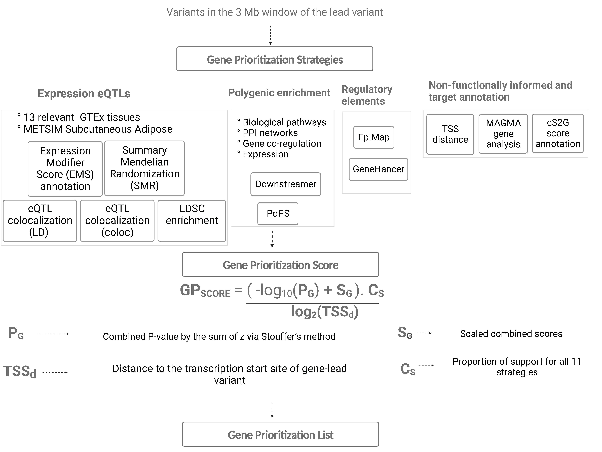

# GPScore 
The Gene Priority Score (GPScore) is a combinatorial likelihood scoring formalism based on measures derived from 11 gene prioritization strategies and the physical distance to the transcription start site (TSS). Using GPScore, you can prioritize the most probable target genes underlying the GWAS-associated variants.

Accompanying paper:

>Sarsani, Vishal, Brotman, S. M., Yin Xianyong, Y., Lillian Fernandes Silva, L. F., Laakso,M., & Spracklen, C. N. (2023). A multi-ancestry genome-wide meta-analysis, fine-mapping, and gene prioritization approach to characterize the genetic architecture of adiponectin.

## Overview

Genome-Wide Association Studies(GWAS) for complex traits typically result in many significant loci across the genome. Translating these GWAS findings into treatments may require an understanding of target genes and their biological mechanisms. 

The genetic variants linked to a certain trait may not always affect the closest gene and can even impact protein levels located far away. Various methods exist to identify the genes affected by these variants, but they have limitations, such as not being customizable to relevant disease/tissue data and producing conflicting results. GPScore combines multiple gene prioritization strategies and the physical distance to transcription start sites, allowing for customization and unbiased scoring. It can be applied to complex traits with limited training data and does not have individual-level data.




## Dependencies

Recommended OS: Any Linux. Mac OS is not supported but should be compatible.

Outputs from following software/data should be available in text or csv format to calculate the GPScore:

- [Gene to TSS Distances](https://github.com/FinucaneLab/pops/blob/master/example/data/utils/gene_annot_jun10.txt)
- [MAGMA](https://ctg.cncr.nl/software/magma)
- [PoPS](https://github.com/FinucaneLab/pops)
- [colo.susie](https://chr1swallace.github.io/coloc/articles/a06_SuSiE.html)
- [SMR](https://yanglab.westlake.edu.cn/software/smr/#Overview)
- [LDSC](https://github.com/bulik/ldsc/wiki/Partitioned-Heritability)
- [EMS](https://www.finucanelab.org/data)
- [Downstreamer](https://github.com/molgenis/systemsgenetics/wiki/Downstreamer)
- [Epimap](https://personal.broadinstitute.org/cboix/epimap/links/pergroup/)
- [GeneHancer](https://zenodo.org/record/7754032#.ZEP6AvzMIQ8)
- [cS2G](https://zenodo.org/record/7754032#.ZEP6AvzMIQ8)

The following [R](https://www.r-project.org/) (version 4.2.0) packages are required:

   - [tidyverse](https://www.tidyverse.org/) 
   - [devtools](https://CRAN.R-project.org/package=devtools) 
   - [relaimpo](https://cran.r-project.org/web/packages/relaimpo/index.html)
   - [metap](https://cran.r-project.org/web/packages/metap/index.html)


## Example dataset

A dataset is taken from Asian Genetic Epidemiology Network (AGEN : https://blog.nus.edu.sg/agen/).
GWAS meta-analysis (imputed to HapMap2) for adiponectin levels in up to 7,825 East Asians.


```{bash}
zcat data/AGEN_adiponectin_hapmap.txt.gz|head -5
```

## Usage and Tutorial

The main notebook to calculate GPScore is GPscore.ipynb.

Several other notebooks exists to help process the data from other tools 

Here is outline of the notebooks to pre-process data
- [tidyverse](https://www.tidyverse.org/) 
- 
## Authors

   - [Vishal Sarsani](https://vsarsani.com).


## License

This software is distributed under the [GPLv3 license](https://www.gnu.org/licenses/gpl-3.0.en.html).


